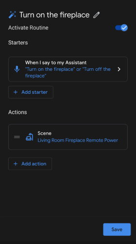

# Home Assistant Configuration

This is my [Home Assistant](https://www.home-assistant.io) configuration for my smart home!  I've been a Home Assistant user since 2019 and have continued to grow my home's capabilities as we add more devices.

#### Table of Contents
1. [Platform](#platform)
1. [Integrations](#integrations)

## Platform

Home Assistant is deployed with the following hardware and software:
- Apple Mac Pro 6,1
- VMWare ESXi 7
- [Home Assistant OVA image for VMWare ESXi/vSphere](https://www.home-assistant.io/installation/alternative)

## Devicess

### Remotes
- [Broadlink RM4 Pro IR/RF Remote](https://a.co/d/j1mcWRS)

## Integrations

### Remote
The remote integration is used to expose IR and RF devices to Home Assistant and the Google Assistant.

For example, our [Duraflame electric fireplace](https://a.co/d/fFEitIg) is controlled by calling the `input_button` entities, which then trigger automations to send the base64 encoded commands via the `remote.send_command` call.

The `input_button` entities are also exposed to Google Assistant.  They can then be used in custom routines to be called by a voice command to the Google Assistant.  `input_button` entities from Home Assistant appear as scenes to Google Assistant.

